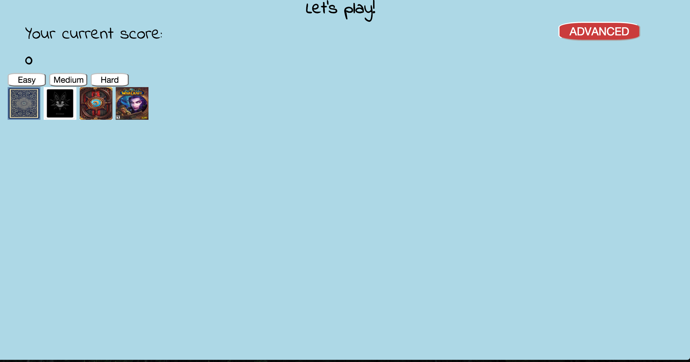
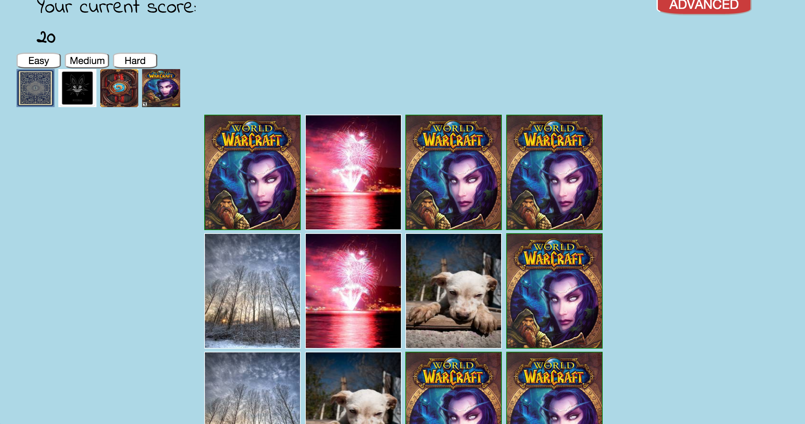
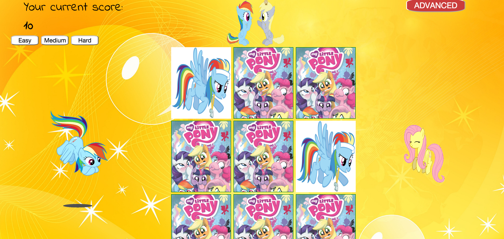

# GameProject
http://aleksa000777.github.io/GameProject/
This is a memory card game!
Simple and easy to play
First choose level of the game:
    * easy
    * medium
    * hard
    

  this will set card on board
  You can start play, just click on card and try to find second card. You can see your score on the top of the screen.
  Less score - better score!
  

  Also you can change back of the cards.
  For bravest gamers you can click on ADVANCED button and enjoy game on hardest level :)
  

  If you want to restart game just click on any level (easy, medium, hard or advance) and the board will be ready to new game

  In this game I use simple HTML5 and CSS, with JavaScript and JQuery.
  The is no installation instructions, just play even throw your phone

  
